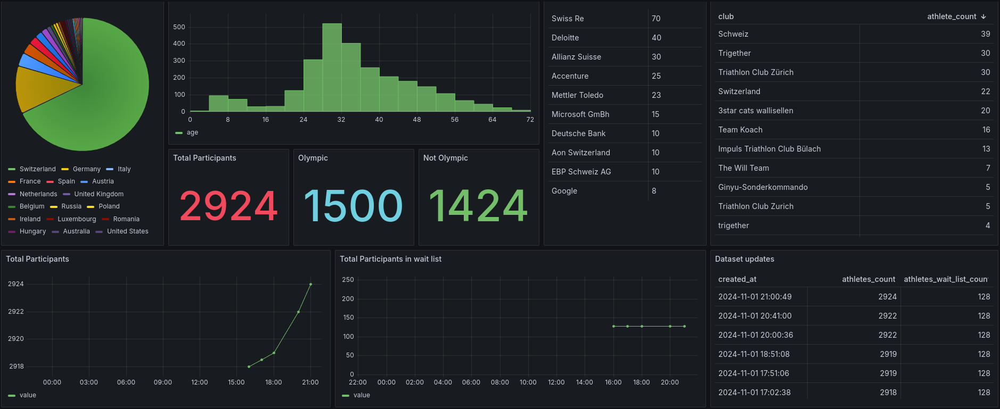

# Triathlon Event Data Pipeline

An automated data pipeline that collects athlete registration data from the 2025 Zurich City Triathlon event. The system performs periodic data collection, stores it in PostgreSQL, and provides visualization through Grafana dashboards.

## Dashboard Preview



## Architecture Overview

- **Data Collection**: Python script fetches and cleans athlete data from race registration system
- **Storage**: PostgreSQL database for data persistence
- **Scheduling**: AWS Lambda with CloudWatch Events for hourly execution
- **Infrastructure**: Terraform for AWS resource management
- **Visualization**: Grafana dashboards for data analysis
- **CI/CD**: GitHub Actions for automated deployment


### Prerequisites

- Python 3.12+
- PostgreSQL
- Docker and Docker Compose
- AWS CLI & Terraform

### Local Development

Configure you local PostgreSQL credentials in `lambda_function.py`:
```python
config = {
    "host": "localhost",
    "port": 5432,
    "dbname": "postgres",
    "user": "postgres",
    "password": "postgres",
}
```

Then install packages in requirements.txt

### Creating Lambda Package

Build the Lambda deployment package using Docker (TODO docker ignore):
```bash
docker build -t lambda-builder .
docker create --name temp_container lambda-builder
docker cp temp_container:/build/lambda_package.zip ./lambda_package.zip
docker rm temp_container
```

This will create `lambda_package.zip` containing the function and its dependencies.

## Deployment

### AWS Deployment

1. Configure GitHub Actions secrets:
   - `AWS_ACCESS_KEY_ID`
   - `AWS_SECRET_ACCESS_KEY`
   - `AWS_REGION`

2. Push to the repository - GitHub Actions will handle:
   - Building Lambda package
   - Running Terraform
   - Deploying infrastructure

Alternatively, you can deploy manually using AWS CLI and Terraform if you prefer direct control.

### Grafana Setup

1. Configure database connection in `dashboard/provisioning/datasources/postgresql.yaml.template`:
```yaml
datasources:
  - name: PostgreSQL
    type: postgres
    url: your-db-host:5432
    database: your-db-name
    user: your-username
    secureJsonData:
      password: your-password
```

2. Rename the template:
```bash
mv postgresql.yaml.template postgresql.yaml
```

3. Start Grafana:
```bash
cd dashboard
docker-compose up -d
```

Access Grafana at `http://localhost:3000`

## Notes

- The RDS instance is configured with public access for development
- Database credentials are managed through AWS Secrets Manager
- Data collection runs hourly by default